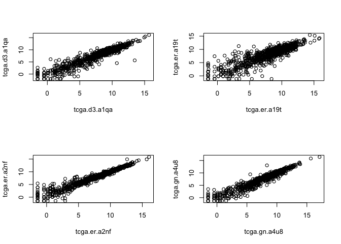
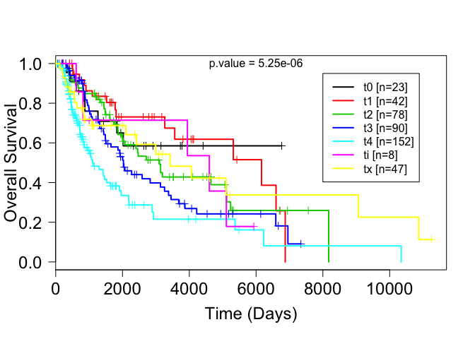
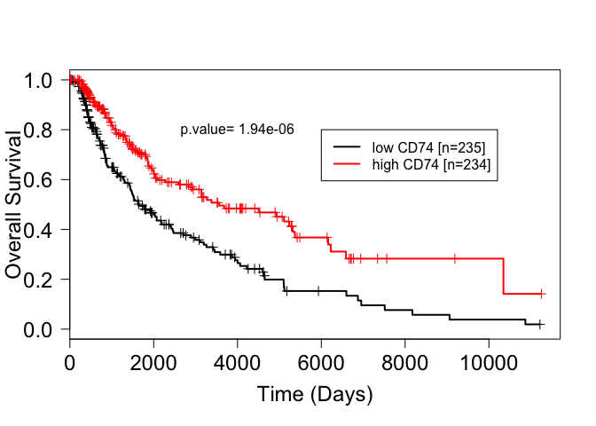

# Introduction

This document outlines the approach i took to download data level 3 TCGA data. RNA-seq, methylation 450K data and clinical information was downloaded using the `RTCGAToolbox`[@Samur2014] package

The `RTCGAToolbox` package written by Samur, retreives data from the broads institutive firehose database. Detailed information on how to use this package are available in the [Vignette](https://www.bioconductor.org/packages/devel/bioc/vignettes/RTCGAToolbox/inst/doc/RTCGAToolbox-vignette.html), online courses [PH525Xseries](http://genomicsclass.github.io/book/pages/tcga.html) and [Youtube](http://rafalab.github.io/pages/harvardx.html) videos. Many of the codes used here were taken from these resources. 


```r
#Load the library
library(RTCGAToolbox)
```

A list of available cancer types are found using the `getFirehoseDatasets` command. The run dates and analyze datas are found using the `getFirehoseRunningDates` and the `getFirehoseAnalyzeDates` commands. 


```r
getFirehoseDatasets()
```

```
##  [1] "ACC"      "BLCA"     "BRCA"     "CESC"     "CHOL"     "COADREAD"
##  [7] "COAD"     "DLBC"     "ESCA"     "FPPP"     "GBMLGG"   "GBM"     
## [13] "HNSC"     "KICH"     "KIPAN"    "KIRC"     "KIRP"     "LAML"    
## [19] "LGG"      "LIHC"     "LUAD"     "LUSC"     "MESO"     "OV"      
## [25] "PAAD"     "PCPG"     "PRAD"     "READ"     "SARC"     "SKCM"    
## [31] "STAD"     "STES"     "TGCT"     "THCA"     "THYM"     "UCEC"    
## [37] "UCS"      "UVM"
```

```r
head(getFirehoseRunningDates())
```

```
## [1] "20160128" "20151101" "20150821" "20150601" "20150402" "20150204"
```

```r
head(getFirehoseAnalyzeDates())
```

```
## [1] "20160128" "20150821" "20150402" "20141017" "20140715" "20140416"
```
 
# Clinical and RNA-seq data - download and process

The clinical information and normalised RNA-seq data is downloaded.
The methylation data is downloaded separately from the clinical and RNA-seq data because its size was too large for my computer to handle. Thus the methylation data was downloaded in separately in our University departments computer cluster. 

Skin cutaneous melanoma (SKCM) is selected and "20160128" is used as the rundate. The default file size is 500 mb and this limit is extended to 3000 mb using `fileSizeLimit`.

The RNA-seq data (RNASeq2GeneNorm) contains normalised gene expression levels generated using **MapSplice** for alignment and **RNA-Seq by Expectation-Maximization (RSEM)** for quantification. RSEM values are calculated using an algorithm that estimate abundances at the gene level to generate TPM (Transcripts Per Million) values. TPM is similar to FPKM and RPKM in that it accounts for total number of reads and gene length. However TPM has gained more popularity over recent years because it is easier to interpret and more stable when comparing between samples. The normalisation is done by dividing the TPM values by the 75th percentile (3rd quartile) and multiplication by 1000.


```r
readDataSKCM <- getFirehoseData (dataset="SKCM", 
                                runDate="20160128",
                                forceDownload = TRUE, 
                                clinical = TRUE, 
                                RNASeq2GeneNorm = TRUE, 
                                Methylation = FALSE, fileSizeLimit= 3000)
```


```r
load("~/Dropbox/GitHub/Downloading-TCGA-data/RDatafiles/TCGA_readDataSKCM.RData")
```


```r
#extract the data
clinSKCM <- getData(readDataSKCM, "clinical")
rnaseqSKCM <- getData(readDataSKCM, "RNASeq2GeneNorm")
```

The clinical and RNA-seq data are processed (or cleaned up) before any downstream analysis.

1) The TCGA barcodes are structured differently between the clinical and RNA-seq datasets and thus needs to be matched. For example the first TCGA barcode in the RNAseq data is "TCGA-3N-A9WB-06A-11R-A38C-07" whereas in the clinical data it is "tcga.d3.a2je"

2) Some samples have 2x RNA-seq data. Duplicate RNA-seq data are removed.

3) Some samples contain RNA-seq data but there is no clinical information. Only those samples that have both RNA-seq and clinical information are retained for downstream analysis. 


```r
#Changing patient identifier names
dim(clinSKCM)
```

```
## [1] 470  18
```

```r
head(clinSKCM)
```

```
##              Composite Element REF years_to_birth vital_status
## tcga.d3.a2je                 value             75            1
## tcga.d3.a2jf                 value             74            0
## tcga.d3.a3c8                 value             58            0
## tcga.d3.a3ml                 value             70            1
## tcga.d3.a51g                 value           <NA>            0
## tcga.d3.a8gi                 value             68            1
##              days_to_death days_to_last_followup
## tcga.d3.a2je           841                  <NA>
## tcga.d3.a2jf          <NA>                  1888
## tcga.d3.a3c8          <NA>                  1409
## tcga.d3.a3ml           422                  <NA>
## tcga.d3.a51g          <NA>                  <NA>
## tcga.d3.a8gi          1780                  <NA>
##              days_to_submitted_specimen_dx pathologic_stage
## tcga.d3.a2je                           140       stage iiic
## tcga.d3.a2jf                           544         stage ia
## tcga.d3.a3c8                             0       stage iiic
## tcga.d3.a3ml                           230       stage iiia
## tcga.d3.a51g                          <NA>          stage 0
## tcga.d3.a8gi                          1653         stage ia
##              pathology_T_stage pathology_N_stage pathology_M_stage
## tcga.d3.a2je                tx                n3                m0
## tcga.d3.a2jf               t1a                n0                m0
## tcga.d3.a3c8                tx                n3                m0
## tcga.d3.a3ml               t3a               n2a                m0
## tcga.d3.a51g               tis                n0                m0
## tcga.d3.a8gi               t1a                n0                m0
##              melanoma_ulceration melanoma_primary_known Breslow_thickness
## tcga.d3.a2je                <NA>                    yes              <NA>
## tcga.d3.a2jf                  no                    yes              0.28
## tcga.d3.a3c8                <NA>                    yes              <NA>
## tcga.d3.a3ml                  no                    yes               2.3
## tcga.d3.a51g                <NA>                    yes                 0
## tcga.d3.a8gi                  no                    yes              0.98
##              gender date_of_initial_pathologic_diagnosis radiation_therapy
## tcga.d3.a2je female                                 2009                no
## tcga.d3.a2jf   male                                 2008                no
## tcga.d3.a3c8 female                                 2009               yes
## tcga.d3.a3ml   male                                 2003                no
## tcga.d3.a51g   male                                 <NA>                no
## tcga.d3.a8gi   male                                 2008                no
##               race              ethnicity
## tcga.d3.a2je white not hispanic or latino
## tcga.d3.a2jf white not hispanic or latino
## tcga.d3.a3c8 white not hispanic or latino
## tcga.d3.a3ml white not hispanic or latino
## tcga.d3.a51g white not hispanic or latino
## tcga.d3.a8gi white not hispanic or latino
```

```r
dim(rnaseqSKCM)
```

```
## [1] 20501   473
```

```r
rnaseqSKCM[1:5,1:5]
```

```
##       TCGA-3N-A9WB-06A-11R-A38C-07 TCGA-3N-A9WC-06A-11R-A38C-07
## A1BG                      381.0662                     195.1822
## A1CF                        0.0000                       0.0000
## A2BP1                       0.0000                       0.0000
## A2LD1                     250.1979                     160.7548
## A2ML1                       7.2698                       0.0000
##       TCGA-3N-A9WD-06A-11R-A38C-07 TCGA-BF-A1PU-01A-11R-A18S-07
## A1BG                      360.8794                     176.3994
## A1CF                        0.7092                       0.0000
## A2BP1                       6.3830                       1.2987
## A2LD1                      97.1986                     163.2338
## A2ML1                       0.0000                       7.7922
##       TCGA-BF-A1PV-01A-11R-A18U-07
## A1BG                      216.8470
## A1CF                        0.0000
## A2BP1                       0.0000
## A2LD1                      60.8727
## A2ML1                       0.5977
```

```r
#The identifiers in the RNA-seq data are transformed to be the same as the ones in the clinical data. This includes substringing the first 12 characters and replacing "-" with "."

rid = tolower(substr(colnames(rnaseqSKCM),1,12))
rid = gsub("-", ".", rid)  
colnames(rnaseqSKCM) = rid 

length(intersect(rid,rownames(clinSKCM))) # 469 samples intersect between RNAseq and clinSKCM
```

```
## [1] 469
```


```r
#Remove duplicated samples
#Samples with duplicated names are removed. The data between the replicates are very similar however looking into the original barcodes, some of the duplicates are primary or metastatic, or a normal solid tumour. Tumours that are labeled primary, normal solid tumour or additional metastatic are removed. 

duplicatedSamples <- which(duplicated(colnames(rnaseqSKCM))) # 4  duplicate samples

duplicatedSampleNames <- colnames(rnaseqSKCM)[duplicated(colnames(rnaseqSKCM))]

rnaseqMel_duplicated <- rnaseqSKCM[,colnames(rnaseqSKCM) %in% duplicatedSampleNames] #matrix of only those duplicated samples

colnames(rnaseqMel_duplicated)
```

```
## [1] "tcga.d3.a1qa" "tcga.d3.a1qa" "tcga.er.a19t" "tcga.er.a19t"
## [5] "tcga.er.a2nf" "tcga.er.a2nf" "tcga.gn.a4u8" "tcga.gn.a4u8"
```


```r
par(mfrow=c(2,2))
plot(log2(rnaseqMel_duplicated[1001:2000,1:2]))
plot(log2(rnaseqMel_duplicated[1001:2000,3:4]))
plot(log2(rnaseqMel_duplicated[1001:2000,5:6]))
plot(log2(rnaseqMel_duplicated[1001:2000,7:8]))
```



The full TCGA barcodes names of these duplicate samples are investigated. Information on TCGA barcodes are given [here](https://wiki.nci.nih.gov/display/TCGA/TCGA+barcode) and information on the sample type (e.g. primary, metastatic, additional metastsatic) from the TCGA barcode is provided [here](https://gdc.cancer.gov/resources-tcga-users/tcga-code-tables/sample-type-codes). 

```r
index <- which(colnames(rnaseqSKCM) %in% duplicatedSampleNames)

rnaseqSKCM2 <- getData(readDataSKCM, "RNASeq2GeneNorm")
original_rnaseq_barcode <- colnames(rnaseqSKCM2)
original_rnaseq_barcode[index]
```

```
## [1] "TCGA-D3-A1QA-07A-11R-A37K-07" "TCGA-D3-A1QA-06A-11R-A18T-07"
## [3] "TCGA-ER-A19T-06A-11R-A18U-07" "TCGA-ER-A19T-01A-11R-A18T-07"
## [5] "TCGA-ER-A2NF-06A-11R-A18T-07" "TCGA-ER-A2NF-01A-11R-A18T-07"
## [7] "TCGA-GN-A4U8-11A-11R-A32P-07" "TCGA-GN-A4U8-06A-11R-A32P-07"
```

The sample types of these duplicate samples are either of primary solid (01) tumour, metastastic (06), additional metastastic (07) or solid tissue (11) normal. 

Here, from the duplicates, i will retain only metastatic tumours and so I remove the duplicate primary solid tumours, additional metastatic tumour and solid tissue normal. 
1st duplicate samples: remove the additional metastatic
2nd duplicate samples: remove the primary tumour 
3rd duplicate samples: remove the primary
4th duplicate samples: remove the solid tissue normal


```r
remove_index <- c("TCGA-D3-A1QA-07A-11R-A37K-07", "TCGA-ER-A19T-01A-11R-A18T-07",  "TCGA-ER-A2NF-01A-11R-A18T-07", "TCGA-GN-A4U8-11A-11R-A32P-07") #excluding these 

remove_index <- which(original_rnaseq_barcode %in% remove_index)

rnaseqSKCM = rnaseqSKCM[,-remove_index] # getting rid of the duplicate

dim(rnaseqSKCM) # from 473 samples to 469
```

```
## [1] 20501   469
```

```r
length(intersect(colnames(rnaseqSKCM),rownames(clinSKCM)))  #469 samples interect between rnaseqSKCM and clinSKCM
```

```
## [1] 469
```

```r
length(rownames(clinSKCM)) # there is 1 sample in clinMel which there is absent in rnaseqMel 
```

```
## [1] 470
```

```r
clinSKCM <- clinSKCM[intersect(colnames(rnaseqSKCM),rownames(clinSKCM)),]
dim(clinSKCM)
```

```
## [1] 469  18
```

```r
table(colnames(rnaseqSKCM)==rownames(clinSKCM)) # patient names are in the same order
```

```
## 
## TRUE 
##  469
```


```r
#You may wish to create an expression set which contains both RNA-seq and expression matrix. 
library(Biobase)
readES = ExpressionSet(as.matrix(log2(rnaseqSKCM+1)))
pData(readES) = clinSKCM
```


# Survival data clean-up and analysis

## Survival analysis: background

To analyse overall survival, 3 variables in the `clinMel` data set is required, which are "vital_status", "days_to_death" and "days_to_last_followup".

Information is available in a googles forum page [here](https://groups.google.com/forum/#!topic/ucsc-cancer-genomics-browser/YvKnWZSsw1Q) 


```r
dim(clinSKCM)
```

```
## [1] 469  18
```

```r
str(clinSKCM[,c("vital_status","days_to_death","days_to_last_followup")])
```

```
## 'data.frame':	469 obs. of  3 variables:
##  $ vital_status         : chr  "1" "0" "1" "0" ...
##  $ days_to_death        : chr  "518" NA "395" NA ...
##  $ days_to_last_followup: chr  NA "2022" NA "387" ...
```

```r
clinSKCM[1:5,c("vital_status","days_to_death","days_to_last_followup")]
```

```
##              vital_status days_to_death days_to_last_followup
## tcga.3n.a9wb            1           518                  <NA>
## tcga.3n.a9wc            0          <NA>                  2022
## tcga.3n.a9wd            1           395                  <NA>
## tcga.bf.a1pu            0          <NA>                   387
## tcga.bf.a1pv            0          <NA>                    14
```

* **vital_status:** "1" means deceased and "0" means still alive. 
* **days_to_death:** With patients who are deacesed, the days_to_death variable gives the number of days before death.
* **days_to_last_followup:** With patients who are still alive, the days_to_last_followup variable gives the number of days before the last follow-up.


## Survival data: Exploratory analysis

In 460 out of 469 patients, the days_to_death and days_to_last_followup are mutually exlcusive; if theres an NA in days_to_death then there is a number to DaystoLastfollowup and vice versa. The remaining have NA for both days_to_death and days_to_last_followup. 

```r
table(!is.na(clinSKCM[,"days_to_death"]) & is.na(clinSKCM[,"days_to_last_followup"])) #There are 220 patients who does not contain (NA) days_to_last_followup however contains days_to_death
```

```
## 
## FALSE  TRUE 
##   249   220
```

```r
table(is.na(clinSKCM[,"days_to_death"]) & !is.na(clinSKCM[,"days_to_last_followup"])) #There are 240 patients that do not contain (NA) days_to_death but contain days_to_last_followup
```

```
## 
## FALSE  TRUE 
##   229   240
```

```r
table(is.na(clinSKCM$"days_to_death") & is.na(clinSKCM$"days_to_last_followup")) #there are 9 patinets that contain NA for both days_to_death and days_to_last_followup
```

```
## 
## FALSE  TRUE 
##   460     9
```

There are 9 patients with both "days_to_death" and "days_to_last_followup" as NA.

```r
survivalVariables <- c("days_to_last_followup","vital_status","days_to_death")

index <- is.na(clinSKCM[,"days_to_death"]) & is.na(clinSKCM[,"days_to_last_followup"])
clinSKCM[index,survivalVariables]
```

```
##              days_to_last_followup vital_status days_to_death
## tcga.d3.a3c1                  <NA>            0          <NA>
## tcga.d3.a3c3                  <NA>            0          <NA>
## tcga.d3.a51g                  <NA>            0          <NA>
## tcga.d3.a8go                  <NA>            1          <NA>
## tcga.er.a19o                  <NA>            1          <NA>
## tcga.fr.a3yo                  <NA>            0          <NA>
## tcga.rp.a695                  <NA>            0          <NA>
## tcga.rp.a6k9                  <NA>            0          <NA>
## tcga.yd.a9tb                  <NA>            0          <NA>
```

```r
dim(clinSKCM[index,survivalVariables])
```

```
## [1] 9 3
```

There is also 1 patient with a negative days_to_last_followup. What does this mean?

```r
survivalVariables <- c("days_to_last_followup","vital_status","days_to_death")

index <- which(clinSKCM[,"days_to_death"] < 0 | clinSKCM[,"days_to_last_followup"] < 0)

clinSKCM[index,survivalVariables]
```

```
##              days_to_last_followup vital_status days_to_death
## tcga.eb.a430                    -2            0          <NA>
```

## Survival analysis: merge days_to_death and days_to_last_followup

Here i merge days_to_death and days_to_last_followup to create a new variable called new_death. Most are simple to handle because they are mutually exlcusive; if there's an NA in days_to_death then there is a number to days_to_last_followup and vice versa. 

DELETE: However, as shown above, some patients have values to both variables with different number of days which i am unsure what that means. Also some patients have an NA to both variables. 

Here i create a new variable called new_death in which:
* If patient has deceased (1 in vital status), the days_to_death is selected
* If patient is alive (0 in vital status), days_to_last_followup is selected


```r
mergeOS <- ifelse(clinSKCM[,"vital_status"]==1, clinSKCM[,"days_to_death"], clinSKCM[,"days_to_last_followup"] )

str(mergeOS)
```

```
##  chr [1:469] "518" "2022" "395" "387" "14" "282" "853" "831" "464" ...
```

```r
table(is.na(mergeOS))
```

```
## 
## FALSE  TRUE 
##   460     9
```

```r
clinSKCM$mergeOS <- as.numeric(mergeOS)
```


## Survival analysis: sanity check with t-stage

Here i perform a "sanity check" to see if the survival data makes sense. First i look at the prognosis according to the tumour T stage. 

* t0 - patients without a known primary tumor.
* t1 - melanoma is less than 1 mm thick
* t2 - melanoma is between 1 mm and 2 mm thick
* t3 - melanoma is between 2 mm and 4 mm thick
* t4 - melanoma is more than 4 mm thick
* tis - Melanoma in situ
* tx - Primary tumor cannot be assessed (e.g. severely regressed melanoma or curettaged melanoma)


```r
library(survival)
```


```r
ev <- as.numeric(clinSKCM$vital_status)
fut <-as.numeric(clinSKCM$mergeOS)
su = Surv(fut, ev)

# There are 15 different types of T-stage. Here i reduce this number to 7 different groups. 
table(clinSKCM$pathology_T_stage)
```

```
## 
##  t0  t1 t1a t1b  t2 t2a t2b  t3 t3a t3b  t4 t4a t4b tis  tx 
##  23  10  22  10  32  31  15  14  39  37  15  25 112   8  47
```

```r
table(substr(clinSKCM$pathology_T_stage,1,2)) 
```

```
## 
##  t0  t1  t2  t3  t4  ti  tx 
##  23  42  78  90 152   8  47
```

```r
t_stage = factor(substr(clinSKCM$pathology_T_stage,1,2))
```


```r
plot(survfit(su~t_stage),mark.time=TRUE, lwd=2, col=1:7, las=1, cex.axis=1.5)
mtext("Overall Survival", side=2, line=2.7, cex=1.5)
mtext("Time (Days)", side=1, line=2.8, cex=1.5)

ntab = table(t_stage)
ns = paste("[n=", ntab, "]", sep="")
legend(8000, .95, col=1:7, lwd=2, legend=paste(levels(t_stage), ns))
text(6000,1, paste("p.value = 5.25e-06"))
```




```r
summary(coxph(su~t_stage))
```

```
## Call:
## coxph(formula = su ~ t_stage)
## 
##   n= 433, number of events= 205 
##    (36 observations deleted due to missingness)
## 
##              coef exp(coef) se(coef)      z Pr(>|z|)   
## t_staget1 -0.1524    0.8586   0.4383 -0.348  0.72803   
## t_staget2  0.2414    1.2730   0.3876  0.623  0.53351   
## t_staget3  0.5201    1.6822   0.3816  1.363  0.17289   
## t_staget4  1.0727    2.9231   0.3759  2.854  0.00432 **
## t_stageti  0.3821    1.4654   0.5718  0.668  0.50394   
## t_stagetx  0.2102    1.2340   0.4250  0.495  0.62084   
## ---
## Signif. codes:  0 '***' 0.001 '**' 0.01 '*' 0.05 '.' 0.1 ' ' 1
## 
##           exp(coef) exp(-coef) lower .95 upper .95
## t_staget1    0.8586     1.1646    0.3637     2.027
## t_staget2    1.2730     0.7856    0.5955     2.721
## t_staget3    1.6822     0.5945    0.7963     3.554
## t_staget4    2.9231     0.3421    1.3993     6.106
## t_stageti    1.4654     0.6824    0.4778     4.494
## t_stagetx    1.2340     0.8104    0.5364     2.839
## 
## Concordance= 0.624  (se = 0.023 )
## Rsquare= 0.071   (max possible= 0.992 )
## Likelihood ratio test= 31.92  on 6 df,   p=1.687e-05
## Wald test            = 32.6  on 6 df,   p=1.251e-05
## Score (logrank) test = 34.56  on 6 df,   p=5.255e-06
```

```r
survdiff(su~t_stage)
```

```
## Call:
## survdiff(formula = su ~ t_stage)
## 
## n=433, 36 observations deleted due to missingness.
## 
##              N Observed Expected (O-E)^2/E (O-E)^2/V
## t_stage=t0  23        8     12.7    1.7284    1.8504
## t_stage=t1  42       15     27.4    5.5960    6.5269
## t_stage=t2  76       40     49.4    1.7855    2.3821
## t_stage=t3  89       49     46.3    0.1534    0.1996
## t_stage=t4 152       68     38.5   22.5570   29.1185
## t_stage=ti   7        5      5.3    0.0169    0.0175
## t_stage=tx  44       20     25.4    1.1457    1.4286
## 
##  Chisq= 34.6  on 6 degrees of freedom, p= 5.25e-06
```

There is a significant statistical difference in overall survival between the different T stages. 

It is strange that those patients with melanoma insitu has such a poor prognosis. Here i look at the clinical data of these patients. All 8 of these patients did not have distant metastsis and only 1 presented regional lymph node metastasis. However 5 ended up deceased. 

```r
clinSKCM[clinSKCM$pathology_T_stage %in% "tis",]
```

```
##              Composite Element REF years_to_birth vital_status
## tcga.d3.a2jb                 value             70            1
## tcga.d3.a51g                 value           <NA>            0
## tcga.d3.a51k                 value             51            0
## tcga.d3.a8gr                 value             54            1
## tcga.ee.a183                 value             48            1
## tcga.ee.a20c                 value             59            1
## tcga.ee.a29w                 value             42            0
## tcga.er.a2ne                 value             39            1
##              days_to_death days_to_last_followup
## tcga.d3.a2jb          5110                  <NA>
## tcga.d3.a51g          <NA>                  <NA>
## tcga.d3.a51k          <NA>                  1002
## tcga.d3.a8gr          3943                  <NA>
## tcga.ee.a183           818                  <NA>
## tcga.ee.a20c          4601                  <NA>
## tcga.ee.a29w          <NA>                  5932
## tcga.er.a2ne           613                  <NA>
##              days_to_submitted_specimen_dx pathologic_stage
## tcga.d3.a2jb                          3035          stage 0
## tcga.d3.a51g                          <NA>          stage 0
## tcga.d3.a51k                            20       stage iiib
## tcga.d3.a8gr                          3774          stage 0
## tcga.ee.a183                           447          stage 0
## tcga.ee.a20c                          4469          stage 0
## tcga.ee.a29w                          4954          stage 0
## tcga.er.a2ne                           567          stage 0
##              pathology_T_stage pathology_N_stage pathology_M_stage
## tcga.d3.a2jb               tis                n0                m0
## tcga.d3.a51g               tis                n0                m0
## tcga.d3.a51k               tis               n2b                m0
## tcga.d3.a8gr               tis                n0                m0
## tcga.ee.a183               tis                n0                m0
## tcga.ee.a20c               tis                n0                m0
## tcga.ee.a29w               tis                n0                m0
## tcga.er.a2ne               tis                n0                m0
##              melanoma_ulceration melanoma_primary_known Breslow_thickness
## tcga.d3.a2jb                <NA>                    yes              <NA>
## tcga.d3.a51g                <NA>                    yes                 0
## tcga.d3.a51k                <NA>                    yes                 0
## tcga.d3.a8gr                <NA>                    yes              0.01
## tcga.ee.a183                <NA>                    yes              <NA>
## tcga.ee.a20c                <NA>                    yes              <NA>
## tcga.ee.a29w                <NA>                    yes                 0
## tcga.er.a2ne                <NA>                    yes              <NA>
##              gender date_of_initial_pathologic_diagnosis radiation_therapy
## tcga.d3.a2jb female                                 1997                no
## tcga.d3.a51g   male                                 <NA>                no
## tcga.d3.a51k   male                                 2011                no
## tcga.d3.a8gr female                                 1999                no
## tcga.ee.a183   male                                 2007                no
## tcga.ee.a20c   male                                 1997                no
## tcga.ee.a29w   male                                 1997               yes
## tcga.er.a2ne   male                                 2007               yes
##                                   race              ethnicity mergeOS
## tcga.d3.a2jb black or african american not hispanic or latino    5110
## tcga.d3.a51g                     white not hispanic or latino      NA
## tcga.d3.a51k                     white     hispanic or latino    1002
## tcga.d3.a8gr                     white not hispanic or latino    3943
## tcga.ee.a183                     white not hispanic or latino     818
## tcga.ee.a20c                     white not hispanic or latino    4601
## tcga.ee.a29w                     white not hispanic or latino    5932
## tcga.er.a2ne                     white not hispanic or latino     613
```


## Survival analysis: sanity check with CD74

Another "sanity check" is done but this time with using the RNAseq data. CD74 gene exprresion was found to be associated with good prognosis using SKCM TCGA data [@Ekmekcioglu2016]. 


```r
#Patient samples are split into high and low CD74 expression using the median as the cut-off
CD74 <- ifelse(rnaseqSKCM["CD74",] > median(rnaseqSKCM["CD74",]), 1, 0)
# higher than median is 1, lower than median is 0
CD74 <- as.factor(CD74)
table(CD74)
```

```
## CD74
##   0   1 
## 235 234
```

```r
ev <- as.numeric(clinSKCM$vital_status)
fut <-as.numeric(clinSKCM$mergeOS)
su = Surv(fut, ev)
```


```r
plot(survfit(su~CD74),mark.time=TRUE, lwd=2, col=c("black","red"), las=1, cex.axis=1.5)
mtext("Overall Survival", side=2, line=2.7, cex=1.5)
mtext("Time (Days)", side=1, line=2.8, cex=1.5)

ntab = table(CD74)
ns = paste("[n=", ntab, "]", sep="")

legend(6000, .8, col= c("black","red"), lwd=2, legend=paste(c("low CD74", "high CD74"), ns))
text(4000,0.8, paste("p.value= 1.94e-06"))
```




```r
survdiff(su~CD74, data=clinSKCM)
```

```
## Call:
## survdiff(formula = su ~ CD74, data = clinSKCM)
## 
## n=460, 9 observations deleted due to missingness.
## 
##          N Observed Expected (O-E)^2/E (O-E)^2/V
## CD74=0 230      133       98      12.5      22.7
## CD74=1 230       87      122      10.0      22.7
## 
##  Chisq= 22.7  on 1 degrees of freedom, p= 1.94e-06
```

# Methylation 450K data - download and processing

The methylation 450K data-frame was too big (>6gb) to download or work with in my desktop. It has 485,577 rows and 478 columns with each value having many digits. Therefore I had to use our cluster network to download the data and then reduce the file size by lowering the number of decimal points for every beta-value. The size-reduced file was then moved to my desktop and loaded into `R`. 


```r
#This was done in our DSM cluster
#downloading the methylation 450k data from TCGA melanoma samples
readDataSKCM_methylation <- getFirehoseData(dataset = "SKCM",
                               runDate = "20160128",
                               forceDownload = TRUE,
                               clinical = FALSE,
                               RNASeq2GeneNorm = FALSE,
                               Methylation = TRUE,
                               fileSizeLimit = 3000)

me450kSKCM = getData(readDataSKCM_methylation, "Methylation",1) 
```


```r
probeinfo <- me450kSKCM[,1:3] 
me450kSKCM <- me450kSKCM[,-(1:3)]

me450kSKCM <- sapply(me450kSKCM, as.numeric)

save.image("methylation450k_20160128_raw.RData")

#scp /home/STUDENT/ahnje770/methylation450k_20160128_raw.RData  /mnt/hcs/dsm-eccles-seq


names(as.list(.GlobalEnv)) #too look at the varialbes in the global environment (in the DSM cluster)

#to load it in the future in DSM cluster
load("/mnt/hcs/dsm-eccles-seq/methylation450k_files/methylation450k_20160128_raw.RData")
```


## Change the identifier names in the methylation data


```r
rid = tolower(substr(colnames(me450kSKCM),1,12))
rid = gsub("-", ".", rid)

duplicatedSampleNames_me450k <- rid[which(duplicated(rid))]
colnames(me450kSKCM)[rid %in% duplicatedSampleNames_me450k]
# [1] "TCGA-D3-A1QA-07A-11D-A373-05" "TCGA-D3-A1QA-06A-11D-A19B-05"
# [3] "TCGA-ER-A19T-06A-11D-A19D-05" "TCGA-ER-A19T-01A-11D-A19D-05"
# [5] "TCGA-ER-A2NF-06A-11D-A19D-05" "TCGA-ER-A2NF-01A-11D-A19D-05"
# [7] "TCGA-FW-A3R5-11A-11D-A23D-05" "TCGA-FW-A3R5-06A-11D-A23D-05"
# [9] "TCGA-GN-A4U8-11A-11D-A32S-05" "TCGA-GN-A4U8-06A-11D-A32S-05"

#Just as the RNA-seq data, here I remove the additional metastatic, primary tumours, and normal solid tissues 

#removing the duplicated samples here
#1st duplicate: remove the additional metastatic (07)
#2nd duplicate: remove the primary tumour (01)
#3rd duplicate: remove the primary (01)
#4th duplicate: remove the solid tissue normal (11)
#5th duplicate: remove the solid tissue normal (11)

#01 Primary solid tumour 
#06 metastatic
#07 additional metastastatic
#11 Solid tissue normal 

remove_index <- c("TCGA-D3-A1QA-07A-11D-A373-05", "TCGA-ER-A19T-01A-11D-A19D-05" ,  "TCGA-ER-A2NF-01A-11D-A19D-05", "TCGA-FW-A3R5-11A-11D-A23D-05", "TCGA-GN-A4U8-11A-11D-A32S-05")
remove_index <- which(colnames(me450kSKCM) %in% remove_index)
remove_index #the rows i will be removing for the duplicated samples
#[1]  36 316 324 387 414

me450kSKCM = me450kSKCM[,-remove_index] # getting rid of the duplicate

dim(me450kSKCM) # from 475 samples to 470
table(duplicated(colnames(me450kSKCM)))
#FALSE 
#  470

rid = tolower(substr(colnames(me450kSKCM),1,12))
rid = gsub("-", ".", rid)

colnames(me450kSKCM) <- rid

length(intersect(colnames(me450kSKCM),colnames(rnaseqSKCM)))  #469 samples interect between meTIL_probes and rnaseqSKCM
length(colnames(meTIL_probes)) # there is 1 sample in clinMel which there is absent in rnaseqMel 

me450kSKCM <- me450kSKCM[,intersect(colnames(me450kSKCM),colnames(rnaseqSKCM))]
dim(meTIL_probes)

table(colnames(rnaseqSKCM)==colnames(me450kSKCM)) # patient names are in the same order
```


## Reducing the size of the methylation 450K data


```r
str(me450kSKCM) # this shows that all the values are characters. 

me450kSKCM <- sapply(me450kSKCM, as.numeric) 
me450kSKCM_rounded <- as.matrix(round(me450kSKCM, digits=3)) # Round to 3 digits
write.csv(me450kSKCM_rounded, "me450kSKCM_rounded.csv")

#scp /home/STUDENT/ahnje770/me450kSKCM_rounded.csv /mnt/hcs/dsm-eccles-seq

rm(me450kSKCM) #remove the unrounded me450kfile
setwd("/mnt/hcs/dsm-eccles-seq/methylation450k_files")

save.image("methylation450k_20160128_rounded.RData")
```

After i reduced the size of the methylation data to generate `me450kMel_rounded`, I saved into my computer for loading.


```r
load ("~/Dropbox/GitHub/RDatafiles/methylation450k_20160128_rounded.RData")

# load("/Volumes/dsm-eccles-seq/methylation450k_files/methylation450k_20160128_rounded.RData") #"/Volumes" (on my dekstop) is the same as "/mnt/hcs" (in DSM cluster)

dim(me450kSKCM_rounded)
```

```
## [1] 485577    469
```

```r
dim(probeinfo)
```

```
## [1] 485577      3
```

```r
class(me450kSKCM_rounded)
```

```
## [1] "matrix"
```

```r
me450kSKCM_rounded[1:3,1:3]
```

```
##            tcga.3n.a9wb tcga.3n.a9wc tcga.3n.a9wd
## cg00000029        0.517        0.419        0.215
## cg00000108           NA           NA           NA
## cg00000109           NA           NA           NA
```

## Acquring methylation probe values for meTIL-score

It was demonstrated that methylation probe values can be used to determine the level of CD8 immune cells within bulk tumour [@Jeschke2017]. 

Beta-values of 5 CpG probes are needed to generate the meTIL-score. Here i did not use me450kMel_rounded but used the data prior to rounding to 3 decimal points.


```r
meTIL_probes <- c("cg20792833","cg20425130","cg23642747","cg12069309","cg21554552") # the 5 CpG probes needed to generate the meTIL-score.

me450kMel[1:3,1:6] 
```
            X Gene_Symbol Chromosome Genomic_Coordinate
1 cg00000029        RBL2         16           53468112
2 cg00000108     C3orf35          3           37459206
3 cg00000109      FNDC3B          3          171916037
  TCGA.3N.A9WB.06A.11D.A38H.05 TCGA.3N.A9WC.06A.11D.A38H.05
1                       0.5167                       0.4193
2                           NA                           NA
3                           NA                           NA


```r
write.csv(me450kMel[me450kMel$X%in%probes_iwant,], file="meTIL_probes.csv")
```

The "meTIL_probes.csv" file is transfered from the server to my computer and then loaded. 


```r
meTIL_probes <- read.csv("~/Dropbox/Education/Bioinformatics/5DataAnalysis/TCGAmelanoma/Methylation/meTIL_probes.csv", row.name=1)
meTIL_probes <- read.csv("~/Dropbox/Education/Bioinformatics/5. DataAnalysis/TCGAmelanoma/Methylation/meTIL_probes.csv", row.name=1)

dim(meTIL_probes)
meTIL_probe_info <- meTIL_probes[,1:3] # separating out the probe info from the probe values
meTIL_probes <- meTIL_probes[,4:478]
```


Changing identifier names and removing duplicates as was done before. 

```r
rid = tolower(substr(colnames(meTIL_probes),1,12))
rid = gsub("-", ".", rid)

colnames(meTIL_probes) <- rid

table(colnames(rnaseqMel)%in%colnames(meTIL_probes)) 
# All of the RNA-seq patient identifiers are also in the methylation identifiers

which(duplicated(colnames(meTIL_probes))) # There are 5 duplicates
colnames(meTIL_probes)[c(36,37,315,316,323,324,387,388,414,415)]

duplicated_SampleNames <- colnames(meTIL_probes)[duplicated(colnames(meTIL_probes))]

meTIL_duplicated<- meTIL_probes[,colnames(meTIL_probes)%in%duplicated_SampleNames]
colnames(meTIL_duplicated)
par(mfrow=c(2,3))
plot(meTIL_duplicated[,1],meTIL_duplicated[,2])
plot(meTIL_duplicated[,3],meTIL_duplicated[,4])
plot(meTIL_duplicated[,5],meTIL_duplicated[,6])
plot(meTIL_duplicated[,7],meTIL_duplicated[,8])
plot(meTIL_duplicated[,9],meTIL_duplicated[,10])
```
There seems to be more variation in the methylation 450K data compared to the RNA-seq data within the duplicates. But I'm not sure which one to take so i will drop the second data.


```r
meTIL_probes <- meTIL_probes[,!duplicated(colnames(meTIL_probes))] # dropping the duplicates

dim(meTIL_probes)
dim(rnaseqMel)

table(colnames(meTIL_probes)%in%colnames(rnaseqMel))
# Theres 1 extra sample in meTIL_probes which is not in rnaseqMel

meTIL_probes <- meTIL_probes[,colnames(meTIL_probes )%in%colnames(rnaseqMel)] 

table(colnames(meTIL_probes) == colnames(rnaseqMel)) # Everything is in the same order and matches. 
```


```r
write.csv(meTIL_probe_info, file="meTIL_probe_info.csv")
write.csv(meTIL_probes, file="meTIL_probes.csv")
```


# References

